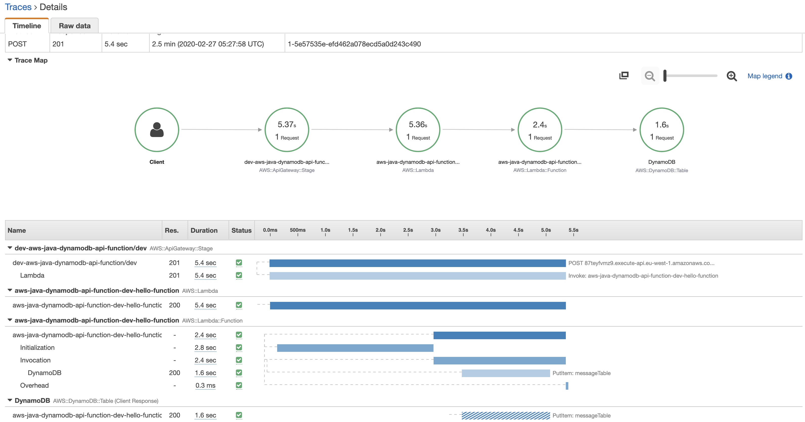
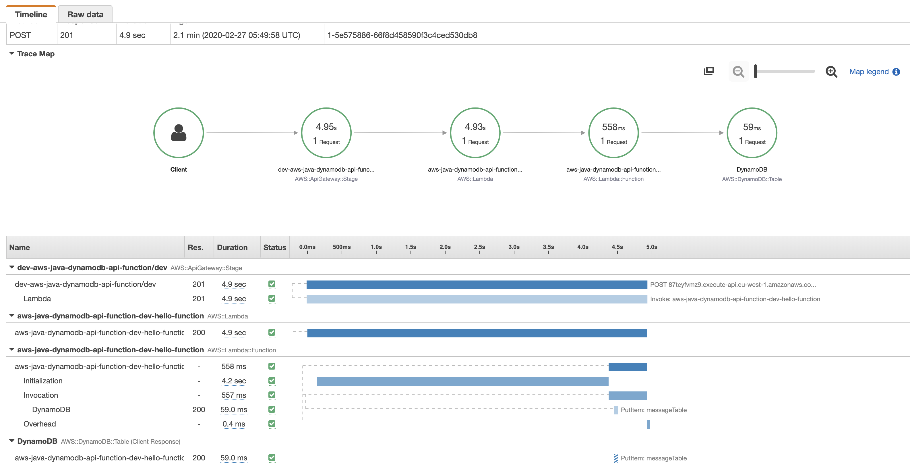
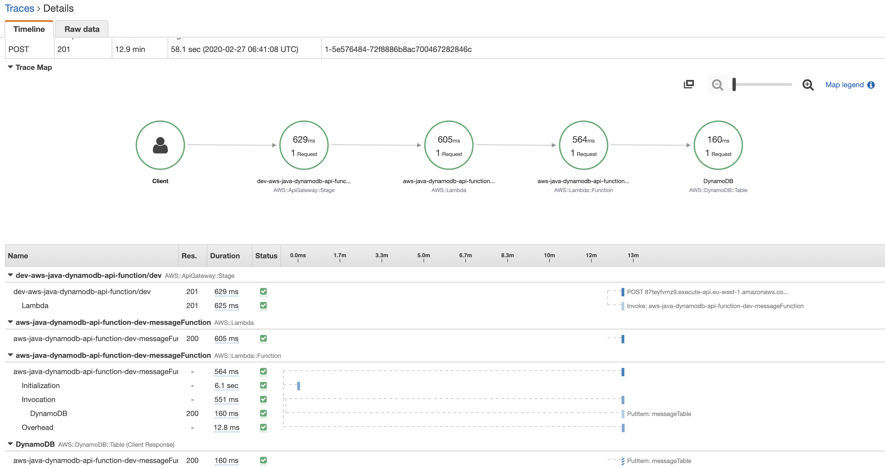
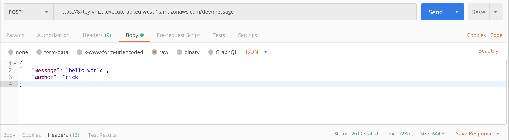

# dynamodb startup issue

## build and deploy
* build: `./build.sh`
* deploy: `./deploy.sh`
* build-and-deploy: `./build-and-deploy.sh`

## use

* Get the endpoint from the output of the deploy or run `sls info`
* send the following payload:
    ```json
    {
        "message": "hello world",
        "author": "nick"
    }
    ```
 * tail logs: `serverless logs -f messageFunction -t`
 
 ## more
 For DynamoDB the SDK lazily initializes the marshallers.
 A couple of workarounds can be created to avoid a heavy coldstart penalty.
 
 

 * You could "ping" DynamoDB in a static block to have the marshallers set up during init phase.
 Since you have access to the host memory at this face this will decrease the total setup time.

 

 
 * When you add provisioned concurrency the marshallers are already setup during the provisioning phase.
 Which is a big improvement.
 
 
 

 ## author
 [https://twitter.com/TheNickVanHoof](https://twitter.com/TheNickVanHoof)